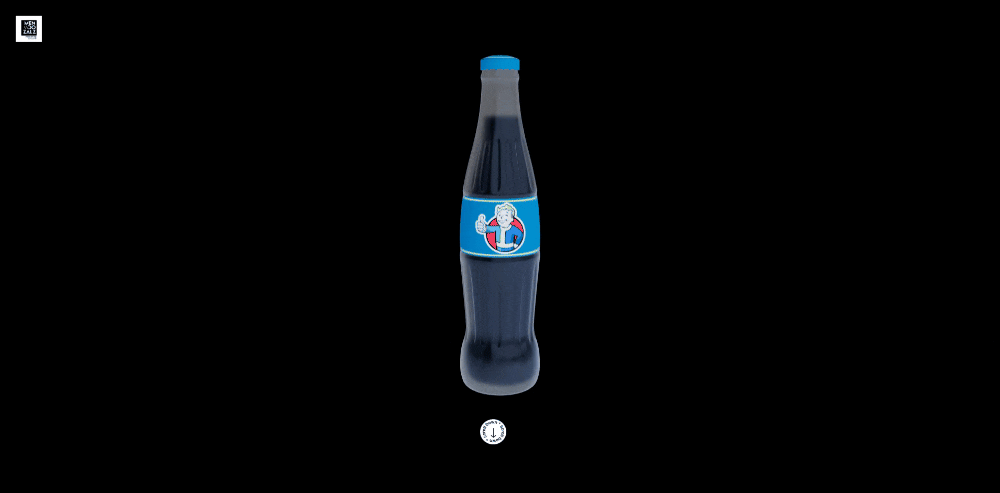

# Fallout Drink - ThreeJs

| PC                                                                                                                                          |
| ---------------------------------------------------------------------------------------------------------------------------------------------- |
|  |  |

Ver en [Netlify](https://fallout-drink.netlify.app/)

## 🚀 Fallout Fans

Este proyecto demuestra la integración de contenido HTML dentro de un modelo 3D acompañado de scroll animations con GSAP, utilizando canvas y manipulación del DOM.

## Instalación

Solo debes copiar el repositorio tal como muestra la imagen

  

luego ve a la terminal y haz un git clone tal como muestra la imagen

  

Ingresas a la carpeta descargada (clonada) y ejecutala con **npm run start**

## Happy Coding

Sientete libre de hacer los cambios que creas pertinentes.
